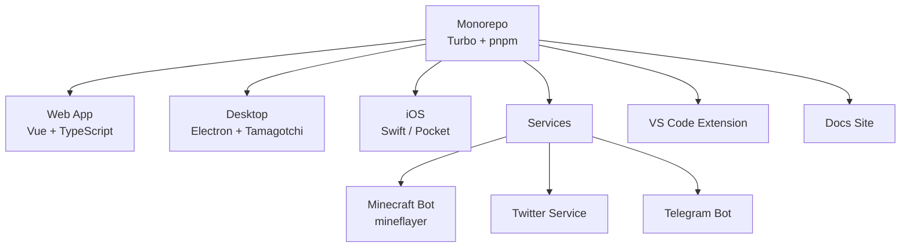

  

      

  <b>Self-hosted AI companion — a container of souls</b>

---

## 🤖 Overview

An open-source attempt to create a cyber companion — a monorepo with 45+ packages spanning web, desktop (Electron), iOS (Swift), Minecraft bot, Twitter/Telegram services, and a VS Code extension.

---

## 🛠️ Architecture

## 🚀 Tech Stack

        

---

  

